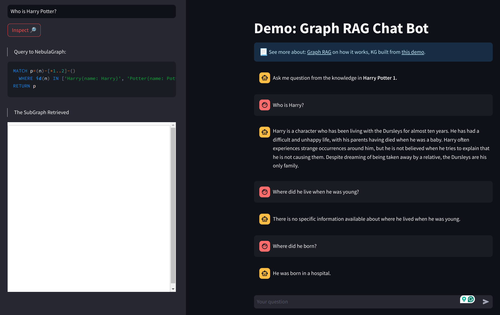

## Update
- Fix the stable version of llama-index
  - Specified all the requirements in [requirements.txt](../requirements.txt)
- Test the memory feature of llama knowledge graph
  
  But sadly, we can't see the sub-graph after finishing asking questions. This sub-graph is what we wanted. I am finding the reason.

## Todo
- [x] Modify [Nebula_graph_store_tutorial.ipynb](../Nebula_graph_store_tutorial.ipynb) to be easily produce Knowledge graphs
  - We can use [graph_rag_chat.py](../graph_rag_chatbot.py) for production.
- [ ] Implement the memory stream structures on ChatMemoryBuffer
- [x] Test Neo4j of compatible with Knowledge Graph Retriever
- [ ] Visualize sub-graph to utilize for memory stream (**new**)