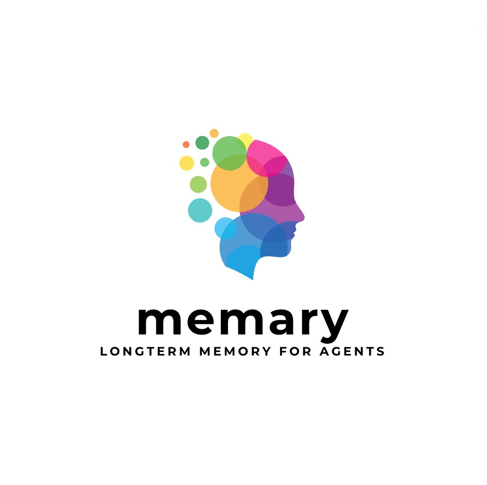

# memary: Open-Source Longterm Memory for Autonomous Agents 

[](https://kingjulio8238.github.io/memarydocs/)
[](https://youtu.be/GnUU3_xK6bg)

## Why use memary?

Agents use LLMs that are currently constrained to finite context windows. memary overcomes this limitation by allowing your agents to store a large corpus of information in knowledge graphs, infer user knowledge through our memory modules, and only retrieve relevant information for meaningful responses.

## Features

- **Routing Agent:** Leverage a ReAct agent to route a query for execution amongst many tools.
- **Knowledge Graph Creation & Retrieval:** Leverage Neo4j to create knowledge graphs storing agent responses for later retrieval.
- **Memory Stream:** Track all entities stored in the knowledge graph using entity extraction. This stream reflects the user's breadth of knowledge.
- **Entity Knowledge Store:** Group and order all the entities in the memory stream and pass the top N entities into the context window. This knowledge store reflects the user's depth of knowledge.

## How it works

The current structure of memary is detailed in the diagram below.


The above process includes the routing agent, knoweldge graph and memory module are all integrated into the `ChatAgent` class located in the `src/agent` directory.

Raw source code for these components can also be found in their respective directories including benchmarks, notebooks, and updates.

## Example use case projects

1. Packing Agent

Packing-Agent is an agent that remembers where you packed your items so that you can later chat with the agent to ask where certain items are placed. It utilized memary long term memory and knowledge graph to achieve this functionality.

[Github Link:](https://github.com/shreybirmiwal/packing-memary)

## Installation
1. With pip:
```
pip install memary
```

2. Locally:
   1. Create your [virtual environment](https://packaging.python.org/en/latest/guides/installing-using-pip-and-virtual-environments/#create-and-use-virtual-environments) and activate it. Note that Python versions 3.12 or greater are not supported by a key dependancy, llama-index and reccomended to run of python versions <= 3.11.9.

   2. Install Python dependencies:
   ```
   pip install -r requirements.txt
   ```

## Demo
**Notes:** memary currently assumes the local installation method and currently supports any models available through Ollama:
- LLM running locally using Ollama (Llama 3 8B/40B as suggested defaults) **OR** `gpt-3.5-turbo`
- Vision model running locally using Ollama (LLaVA as suggested default) **OR** `gpt-4-vision-preview`

memary will default to the locally run models unless explicitly specified.

**To run the Streamlit app:**
1. [Optional] If running models locally using Ollama, follow this the instructions in this [repo](https://github.com/ollama/ollama).

2. Ensure that a `.env` exists with any necessary API keys and Neo4j credentials.

```
OPENAI_API_KEY="YOUR_API_KEY"
NEO4J_PW="YOUR_NEO4J_PW"
NEO4J_URL="YOUR_NEO4J_URL"
PERPLEXITY_API_KEY="YOUR_API_KEY"
GOOGLEMAPS_API_KEY="YOUR_API_KEY"
ALPHA_VANTAGE_API_KEY="YOUR_API_KEY"
```

3. How to get API keys:

```
OpenAI key: https://openai.com/index/openai-api

Neo4j: https://neo4j.com/cloud/platform/aura-graph-database/?ref=nav-get-started-cta
   Click 'Start for free'
   Create a free instance
   Open auto-downloaded txt file and use the credentials

Perplexity key: https://www.perplexity.ai/settings/api

Google Maps:
   Keys are generated in the 'Credentials' page of the 'APIs & Services' tab of Google Cloud Console https://console.cloud.google.com/apis/credentials

Alpha Vantage: (this key is for getting real time stock data)
  https://www.alphavantage.co/support/#api-key
  Reccomend use https://10minutemail.com/ to generate a temporary email to use
```

4.  Update user persona which can be found in `streamlit_app/data/user_persona.txt` using the user persona template which can be found in `streamlit_app/data/user_persona_template.txt`. Instructions have been provided - replace the curly brackets with relevant information. 

5. . [Optional] Update system persona, if needed, which can be found in `streamlit_app/data/system_persona.txt`. 
6. Run:

```
cd streamlit_app
streamlit run app.py
```

## Usage
```python
from memary.agent.chat_agent import ChatAgent

system_persona_txt = "data/system_persona.txt"
user_persona_txt = "data/user_persona.txt"
past_chat_json = "data/past_chat.json"
memory_stream_json = "data/memory_stream.json"
entity_knowledge_store_json = "data/entity_knowledge_store.json"
chat_agent = ChatAgent(
    "Personal Agent",
    memory_stream_json,
    entity_knowledge_store_json,
    system_persona_txt,
    user_persona_txt,
    past_chat_json,
)
```
Pass in subset of `['search', 'vision', 'locate', 'stocks']` as `include_from_defaults` for different set of default tools upon initialization.
### Adding Custom Tools
```python
def multiply(a: int, b: int) -> int:
    """Multiply two integers and returns the result integer"""
    return a * b

chat_agent.add_tool({"multiply": multiply})
```
More information about creating custom tools for the LlamaIndex ReAct Agent  can be found [here](https://docs.llamaindex.ai/en/stable/examples/agent/react_agent/).

### Removing Tools
```python
chat_agent.remove_tool("multiply")
```

## Detailed Component Breakdown

### Routing Agent


- Uses the [ReAct agent](https://react-lm.github.io/) to plan and execute a query given the tools provided. This type of agent can reason over which of the tools to use next to further the response, feed inputs into the selected tool, and repeat the process with the output until it determines that the answer is satisfactory.
- Current tool suite:
  While we didn't emphasize equipping the agent with many tools, we hope to see memary help agents in the community equipped with a vast array of tools covering multi-modalities.
  - **Location** - determines the user's current location and nearby surroundings using geocoder and googlemaps.
  - **CV** - answers a query based on a provided image using gpt-4-vision-preview.
  - **Search** - queries the knowledge graph for a response based on existing nodes and executes an external search if no related entities exist.
- How does it work?
  - Takes in each query &rarr; selects a tool &rarr; executes and finds an answer to current step &rarr; repeats this process until it reaches a satisfactory answer.
- Purpose in larger system
  - Each response from the agent is saved in the knowledge graph. You can view responses from various tools as distinct elements that contribute to the user's knowledge.
- Future contributions
  - Make your own agent and add as many tools as possible! Each tool expands the agent's ability to answer a wide variety of queries.
  - Create an LLM Judge that scores the routing agent and provides feedback.
  - Integrate multiprocessing so that the agent can process multiple sub-queries simultaneously. We have open-sourced the query decomposition and reranking code to help with this!

### Knowledge Graph


- What are knowledge graphs (KG)?
  - KGs are databases that store information in the form of entities, which can be anything from objects to more abstract concepts and their relationships with one another.
- KGs vs other knowledge stores
  - KGs provide more depth of essential context that can be easily retrieved.
  - The knowledge store's graph structure allows information to be centered around certain entities and their relationships with other entities, thus ensuring that the context of the information is relevant.
  - KGs are more adept at handling complex queries, as the varying relationships between different entities in the query can provide insight into how to join multiple subgraphs together.
- Knowledge graphs &harr; LLMs
  - memary uses a Neo4j graph database to store knoweldge.
  - Llamaindex was used to add nodes into the graph store based on documents.
  - Perplexity (mistral-7b-instruct model) was used for external queries.
- What can one do with the KG?
  - Inject the final agent responses into existing KGs.
  - memary uses a [recursive retrieval](https://arxiv.org/pdf/2401.18059.pdf) approach to search the KG, which involves determining what the key entities are in the query, building a subgraph of those entities with a maximum depth of 2 away, and finally using that subgraph to build up the context.
  - When faced with multiple key entities in a query, memary uses [multi-hop](https://neo4j.com/developer-blog/knowledge-graphs-llms-multi-hop-question-answering/) reasoning to join multiple subgraphs into a larger subgraph to search through.
  - These techniques reduce latency compared to searching the entire knowledge graph at once.
- Purpose in larger system
  - Continuously update the memory module with each node insertion.
- Future contributions
  - Expand the graph’s capabilities to support multiple modalities, i.e., images.
  - Graph optimizations to reduce latency of search times.

### Memory Module


- What is the memory module?

The memory module comprises the Memory Stream and Entity Knowledge Store. The memory module was influenced by the design of [K-LaMP](https://arxiv.org/pdf/2311.06318.pdf) proposed by Microsoft Research.

1. The Memory Stream captures all entities inserted into the KG and their associated timestamps. This stream reflects the breadth of the users' knowledge, i.e., concepts users have had exposure to but no depth of exposure is inferred.
   - Timeline Analysis: Map out a timeline of interactions, highlighting moments of high engagement or shifts in topic focus. This helps in understanding the evolution of the user's interests over time.
   - Extract Themes: Look for recurring themes or topics within the interactions. This thematic analysis can help anticipate user interests or questions even before they are explicitly stated.
2. The Entity Knowledge Store tracks the frequency and recency of references to each entity stored in the memory stream. This knowledge store reflects users' depth of knowledge, i.e., concepts they are more familiar with than others.
   - Rank Entities by Relevance: Use both frequency and recency to rank entities. An entity frequently mentioned (high count) and referenced recently is likely of high importance, and the user is well aware of this concept.
   - Categorize Entities: Group entities into categories based on their nature or the context in which they're mentioned (e.g., technical terms, personal interests). This categorization aids in quickly accessing relevant information tailored to the user's inquiries.
   - Highlight Changes Over Time: Identify any significant changes in the entities' ranking or categorization over time. A shift in the most frequently mentioned entities could indicate a change in the user's interests or knowledge.
   - Additional information on the memory modules can be found [here](https://github.com/seyeong-han/KnowledgeGraphRAG)

- Purpose in larger system
  - Compress/summarize the top N ranked entities in the entity knowledge store and pass to the LLM’s finite context window alongside the agent's response and chat history for inference.
  - Personalize Responses: Use the key categorized entities and themes associated with the user to tailor agent responses more closely to the user's current interests and knowledge level/expertise.
  - Anticipate Needs: Leverage trends and shifts identified in the summaries to anticipate users' future questions or needs.
- Future contributions
  - We currently extract the top N entities from the entitiy knowledge store and pass these entities into the context window for inference. memary can future benefit from more advanced memory compression techniques such as passing only entities that are in the agent's response to the context window. We look forward to related community contributions.


## Future Integrations

As mentioned above, memary will benefit from the following integrations:

- Create an LLM Judge that scores the ReACT agent forming a feedback loop. See [Zooter](https://arxiv.org/abs/2311.08692) for insights.
- Expand the knowledge graph’s capabilities to support multiple modalities, i.e., images.
- Optimize the graph to reduce latency of search times.
- Instead of extracting the top N entities from the entity knowledge store deploy more advanced memory compression techniques such as extracting only the entities included in the agent’s response.
- Create an intuitive UI to switch between models easily. We aim to setup memary so that users can use it for free without any costly API integrations.

Currently memary is structured so that the ReAct agent can only process one query at a time. We hope to see **multiprocessing** integrated so that the agent can process many subqueries simultaneously. We expect this to improve the relevancy and accuracy of responses. The source code for both decomposing the query and reranking the many agent responses has been provided, and once multiprocessing has been added to the system, these components can easily be integrated into the main `ChatAgent` class. The diagram below shows how the newly integrated system would work.


### Query Decomposition


- What is query decomposition?
  - A preprocessing technique that breaks down complex queries into simpler queries to expedite the LLM’s ability to answer the prompt. It is important to note that this process leaves simple queries unchanged.
- Why decompose?
  - User queries are complex and multifaceted, and base-model LLMs are often unable to fully understand all aspects of the query in order to create a succinct and accurate response.
  - Allows an LLM of similar capabilities to answer easier questions and synthesize those answers to provide an improved response.
- How it works

  - Initially, a LlamaIndex fine-tuned query engine approach was taken. However, the LangChain query engine was found to be faster and easier to use. LangChain’s `PydanticToolsParser` framework was used. The query_engine_with_examples has been given 87 pre-decomposed queries (complex query + set of subqueries) to determine a pattern. Users can invoke the engine with individual queries or collate them into a list and invoke them by batch.
  - Individual Invocation: `sub_qs = query_analyzer_with_examples.invoke( {"question": "What is 2 + 2? Why is it not 3?"} )`
  - Batch Invocation:
    `questions = [ "Where can I buy a Macbook Pro with an M3 chip? What is the difference to the M2 chip? How much more expensive is  the M3?", "How can I buy tickets to the upcoming NBA game? What is the price of lower bowl seats versus nosebleeds? What is the view like at either seat?", "Between a Macbook and a Windows machine, which is better for systems engineering? Which chips are most ideal? What is the price difference between the two?",] `

    `responses = [] for question in questions: responses.append(query_analyzer_with_examples.invoke({"question": question}))`

- Purpose in larger system
  - In a parallel system, the agent will be able to parse multiple queries at once. The query decomposer (QD) will pass all subqueries (or original query if no subqueries exist) to the agent at once.
  - Simultaneously, QD will pass the original query to the reranking module to rerank the agent responses based on their relevance to the pre-decomposed query.
- Future contributions
  - Once agent multiprocessing is integrated, QD will be valuable to leverage. All user queries will be passed to QD, and the (sub)queries wil be passed to the routing agent for parallel processing.
  - Self-Learning: Whenever queries are decomposed, those examples will be appended to the engine’s example store as a feedback loop for improved future performance.

### Reranking


- What is reranking?
  - Reranking is the process of scoring nodes based on their relevancy.
- Why rerank agent responses?
  - Ensure that the various responses to subqueries, when merged, are relevant to the original query prior to decomposition.
- Our Approach
  - We benchmarked three models to determine which one would best work for reranking: BM25 Reranking Fusion, Cohere Rerank, and ColBERT Rerank. After testing BM25, it was clear that the model was not able to classify the different responses and provide a simple merged answer. Instead of answering the question, it combined all the information on the page, introducing irrelevant information.
  - Next, when testing out Cohere, the model performed better than BM25 but was still not classifying the paragraphs well. The reranking was not always accurate, as it performed well for some questions but was not able to rank others. Furthermore, the ranking was still pretty inaccurate, performing between 0.25 - 0.5 out of 1.
  - Finally, we tested ColBERT rerank, and it was found that this model performed best compared to the other two. ColBERT was able to synthesize results from the given data and ranked them very accurately, with reranking scores between 0.6 - 0.7 out of 1. With this, ColBERT had the most potential, being able to determine which responses were most related and important to answering the query.
- Purpose in larger system
  - Passes the reranking result to the knowledge graph for storage and to the model as one source of context for inference.
- Future contributions
  - Once agent multiprocessing is integrated, reranking can be integrated into the `ChatAgent` class.
  - Future Benchmarking: Include the Cohere Rerank 3 model and others in the [reranking analysis](https://docs.google.com/document/d/1gHzvgktqnHcg7wbIuKHr6W5NMYk6UVlJkRQfSqzk9e4/edit). The data used for benchmarking can be found [here](https://docs.google.com/document/d/1knfJRsoEzjKziilmF_ZwSwMRBvYbF0yNlRdpDteDiW4/edit?usp=sharing). Add to it!

## Contributing

We welcome contributions from the community and hope to see memary advance as agents do!

Initial Contributors: [Julian Saks](https://www.linkedin.com/in/juliansaks/), [Kevin Li](https://www.linkedin.com/in/kevin-li8/), [Seyeong Han](https://github.com/seyeong-han), [Arnav Chopra](https://www.linkedin.com/in/arnav-chopra/), [Aishwarya Balaji](https://www.linkedin.com/in/aishwarya--balaji/), [Anshu Siripurapu](https://www.linkedin.com/in/anshusiripurapu/) (Hook 'em!)

## License

memary is released under the MIT License.
