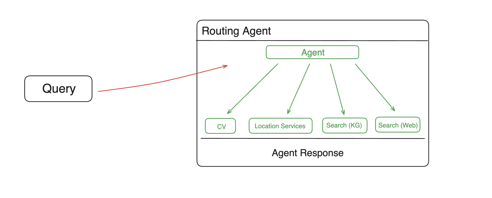

<p align="center">
  
</p>

[](https://www.linkedin.com/company/memary/)
[](https://x.com/memary_labs)
[](https://kingjulio8238.github.io/memarydocs/)
[](https://youtu.be/GnUU3_xK6bg)
[](https://pypi.org/project/memary/)
[](https://pypi.org/project/memary/)
[](https://github.com/kingjulio8238/memary)
[](https://opensource.org/licenses/MIT)


## Manage Your Agent Memories

Agents promote human-type reasoning and are a great advancement towards building AGI and understanding ourselves as humans. Memory is a key component of how humans approach tasks and should be weighted the same when building AI agents. **memary emulates human memory to advance these agents.**

## Quickstart 🏁

### Install memary 
1. With pip:
   
Make sure you are running python version <= 3.11.9, then run 
```
pip install memary
```

2. Locally:
   
i. Create a virtual environment with the python version set as specified above 

ii. Install python dependencies: 
```
pip install -r requirements.txt
```
### Specify Models Used 
At the time of writing, memary assumes installation of local models and we currently support all models available through **Ollama**:

- LLM running locally using Ollama (`Llama 3 8B/40B` as suggested defaults) **OR** `gpt-3.5-turbo`
- Vision model running locally using Ollama (`LLaVA` as suggested default) **OR** `gpt-4-vision-preview`

memary will default to the locally run models unless explicitly specified. Additionally, memary allows developers to **easily switch between downloaded models**. 

### Run memary
**Steps**
1. [Optional] If running models locally using Ollama, follow this the instructions in this [repo](https://github.com/ollama/ollama).

2. Ensure that a `.env` exists with any necessary credentials.

   <details>
     <summary>.env</summary>
  
   ```
   OPENAI_API_KEY="YOUR_API_KEY"
   PERPLEXITY_API_KEY="YOUR_API_KEY"
   GOOGLEMAPS_API_KEY="YOUR_API_KEY"
   ALPHA_VANTAGE_API_KEY="YOUR_API_KEY"
   
   Database usage (see API info):
   FALKORDB_URL="falkor://[[username]:[password]]@[falkor_host_url]:port"
   or
   NEO4J_PW="YOUR_NEO4J_PW"
   NEO4J_URL="YOUR_NEO4J_URL"
   ```
  
   </details>
   

3. Fetch API credentials:
   <details>
     <summary>API Info</summary>

    - [**OpenAI key**](https://openai.com/index/openai-api)
    - [**FalkorDB**](https://app.falkordb.cloud/)
      - Login &rarr; Click 'Subscribe` &rarr; Create a free instance on the Dashboard &rarr; use the credentials (username, passward, falkor_host_url and port).  
    - [**Neo4j**](https://neo4j.com/cloud/platform/aura-graph-database/?ref=nav-get-started-cta)
      - Click 'Start for free` &rarr; Create a free instance &rarr; Open auto-downloaded txt file and use the credentials
    - [**Perplexity key**](https://www.perplexity.ai/settings/api)
    - [**Google Maps**](https://console.cloud.google.com/apis/credentials)
      - Keys are generated in the 'Credentials' page of the 'APIs & Services' tab of Google Cloud Console
    - [Alpha Vantage](https://www.alphavantage.co/support/#api-key)
      - Recommended to use https://10minutemail.com/ to generate a temporary email to use
    
    </details>

4.  Update user persona which can be found in `streamlit_app/data/user_persona.txt` using the user persona template which can be found in `streamlit_app/data/user_persona_template.txt`. Instructions have been provided - replace the curly brackets with relevant information. 

5. [Optional] Update system persona, if needed, which can be found in `streamlit_app/data/system_persona.txt`.
   
6. Run:

```
cd streamlit_app
streamlit run app.py
```

## Basic Usage
```python
from memary.agent.chat_agent import ChatAgent

system_persona_txt = "data/system_persona.txt"
user_persona_txt = "data/user_persona.txt"
past_chat_json = "data/past_chat.json"
memory_stream_json = "data/memory_stream.json"
entity_knowledge_store_json = "data/entity_knowledge_store.json"
chat_agent = ChatAgent(
    "Personal Agent",
    memory_stream_json,
    entity_knowledge_store_json,
    system_persona_txt,
    user_persona_txt,
    past_chat_json,
)
```
Pass in subset of `['search', 'vision', 'locate', 'stocks']` as `include_from_defaults` for different set of default tools upon initialization.

### Adding Custom Tools
```python
def multiply(a: int, b: int) -> int:
    """Multiply two integers and returns the result integer"""
    return a * b

chat_agent.add_tool({"multiply": multiply})
```
More information about creating custom tools for the LlamaIndex ReAct Agent  can be found [here](https://docs.llamaindex.ai/en/stable/examples/agent/react_agent/).

### Removing Custom Tools
```python
chat_agent.remove_tool("multiply")
```

## Core Concepts 🧪
The current structure of memary is detailed in the diagram below.


At the time of writing, the above system design includes the routing agent, knoweldge graph and memory module are all integrated into the `ChatAgent` class located in the `src/agent` directory.

Raw source code for these components can also be found in their respective directories including benchmarks, notebooks, and updates.

### Principles 
memary integrates itself onto your existing agents with as little developer implementation as possible. We achieve this sticking to a few principles. 

- Auto-generated Memory 
    - After initializing memary, agent memory automatically updates as the agent interacts. This type of generation allows us to capture all memories to easily display in your dashboard. Additionally, we allow the combination of databases with little or no code! 

- Memory Modules 
    - Given a current state of the databases, memary tracks users' preferences which are displayed in your dashboard for analysis. 

- System Improvement 
    - memary mimics how human memory evolves and learns over time. We will provide the rate of your agents improvement in your dashboard. 

- Rewind Memories 
    - memary takes care of keeping track of all chats so you can rewind agent executions and access the agents memory at a certain period (coming soon).

### Agent



To provide developers, who don't have existing agents, access to memary we setup a simple agent implementation. We use the [ReAct](https://react-lm.github.io/) agent to plan and execute a query given the tools provided. 

While we didn't emphasize equipping the agent with many tools, the **search tool is crucial to retrieve information from the knowledge graph**. This tool queries the knowledge graph for a response based on existing nodes and executes an external search if no related entities exist. Other default agent tools include computer vision powered by LLaVa and a location tool using geococder and google maps. 

Note: In future version releases, the current ReAct agent (that was used for demo purposes) will be removed from the package so that **memary can support any type of agents from any provider**. 

``` py title="external_query" hl_lines="1"
def external_query(self, query: str):
    messages_dict = [
        {"role": "system", "content": "Be precise and concise."},
        {"role": "user", "content": query},
    ]
    messages = [ChatMessage(**msg) for msg in messages_dict]
    external_response = self.query_llm.chat(messages)

    return str(external_response)
```

``` py title="search" hl_lines="1"
def search(self, query: str) -> str:
    response = self.query_engine.query(query)

    if response.metadata is None:
        return self.external_query(query)
    else:
        return response
```

### Knowledge Graphs


#### Knowledge Graphs ↔ LLMs
- memary uses a graph database to store knoweldge.
- Llama Index was used to add nodes into the graph store based on documents.
- Perplexity (mistral-7b-instruct model) was used for external queries.

#### Knowledge Graph Use Cases
- Inject the final agent responses into existing KGs.
- memary uses a [recursive](https://arxiv.org/pdf/2401.18059.pdf) retrieval approach to search the KG, which involves determining what the key entities are in the query, building a subgraph of those entities with a maximum depth of 2 away, and finally using that subgraph to build up the context.
- When faced with multiple key entities in a query, memary uses [multi-hop](https://neo4j.com/developer-blog/knowledge-graphs-llms-multi-hop-question-answering/) reasoning to join multiple subgraphs into a larger subgraph to search through.
- These techniques reduce latency compared to searching the entire knowledge graph at once.

``` py title="store in KG" hl_lines="1"
def query(self, query: str) -> str:
        # get the response from react agent
        response = self.routing_agent.chat(query)
        self.routing_agent.reset()
        # write response to file for KG writeback
        with open("data/external_response.txt", "w") as f:
            print(response, file=f)
        # write back to the KG
        self.write_back()
        return response
```

``` py title="recursive retrieval" hl_lines="1"
def check_KG(self, query: str) -> bool:
        """Check if the query is in the knowledge graph.

        Args:
            query (str): query to check in the knowledge graph

        Returns:
            bool: True if the query is in the knowledge graph, False otherwise
        """
        response = self.query_engine.query(query)

        if response.metadata is None:
            return False
        return generate_string(
            list(list(response.metadata.values())[0]["kg_rel_map"].keys())
        )
```

### Memory Modules


The memory module comprises the **Memory Stream and Entity Knowledge Store.** The memory module was influenced by the design of [K-LaMP](https://arxiv.org/pdf/2311.06318.pdf) proposed by Microsoft Research.

#### Memory Stream 
The Memory Stream captures all entities inserted into the KG and their associated timestamps. This stream reflects the **breadth of the users' knowledge**, i.e., concepts users have had exposure to but no depth of exposure is inferred.
- Timeline Analysis: Map out a timeline of interactions, highlighting moments of high engagement or shifts in topic focus. This helps in understanding the evolution of the user's interests over time.

``` py title="add to memory stream" hl_lines="1"
def add_memory(self, entities):
        self.memory.extend([
            MemoryItem(str(entity),
                       datetime.now().replace(microsecond=0))
            for entity in entities
        ])
```

- Extract Themes: Look for recurring themes or topics within the interactions. This thematic analysis can help anticipate user interests or questions even before they are explicitly stated.

``` py title="retrieve from memory stream" hl_lines="1"
def get_memory(self) -> list[MemoryItem]:
        return self.memory
```

#### Entity Knowledge Store 
The Entity Knowledge Store tracks the frequency and recency of references to each entity stored in the memory stream. This knowledge store reflects **users' depth of knowledge**, i.e., concepts they are more familiar with than others.
- Rank Entities by Relevance: Use both frequency and recency to rank entities. An entity frequently mentioned (high count) and referenced recently is likely of high importance, and the user is well aware of this concept.

``` py title="select most relevant entities" hl_lines="1"
def _select_top_entities(self):
        entity_knowledge_store = self.message.llm_message['knowledge_entity_store']
        entities = [entity.to_dict() for entity in entity_knowledge_store]
        entity_counts = [entity['count'] for entity in entities]
        top_indexes = np.argsort(entity_counts)[:TOP_ENTITIES]
        return [entities[index] for index in top_indexes]
```

- Categorize Entities: Group entities into categories based on their nature or the context in which they're mentioned (e.g., technical terms, personal interests). This categorization aids in quickly accessing relevant information tailored to the user's inquiries.

``` py title="group entities" hl_lines="1"
def _convert_memory_to_knowledge_memory(
            self, memory_stream: list) -> list[KnowledgeMemoryItem]:
        """Converts memory from memory stream to entity knowledge store by grouping entities 

        Returns:
            knowledge_memory (list): list of KnowledgeMemoryItem
        """
        knowledge_memory = []

        entities = set([item.entity for item in memory_stream])
        for entity in entities:
            memory_dates = [
                item.date for item in memory_stream if item.entity == entity
            ]
            knowledge_memory.append(
                KnowledgeMemoryItem(entity, len(memory_dates),
                                    max(memory_dates)))
        return knowledge_memory
```

- Highlight Changes Over Time: Identify any significant changes in the entities' ranking or categorization over time. A shift in the most frequently mentioned entities could indicate a change in the user's interests or knowledge.
- Additional information on the memory module can be found [here](https://github.com/seyeong-han/KnowledgeGraphRAG)


### New Context Window 


Note: We utilize the the key categorized entities and themes associated with users to tailor agent responses more closely to the user's current interests/preferences and knowledge level/expertise. The new context window is made up of the following: 

- Agent response 
``` py title="retrieve agent response" hl_lines="1"
def get_routing_agent_response(self, query, return_entity=False):
        """Get response from the ReAct."""
        response = ""
        if self.debug:
            # writes ReAct agent steps to separate file and modifies format to be readable in .txt file
            with open("data/routing_response.txt", "w") as f:
                orig_stdout = sys.stdout
                sys.stdout = f
                response = str(self.query(query))
                sys.stdout.flush()
                sys.stdout = orig_stdout
            text = ""
            with open("data/routing_response.txt", "r") as f:
                text = f.read()

            plain = ansi_strip(text)
            with open("data/routing_response.txt", "w") as f:
                f.write(plain)
        else:
            response = str(self.query(query))

        if return_entity:
            # the query above already adds final response to KG so entities will be present in the KG
            return response, self.get_entity(self.query_engine.retrieve(query))
        return response
```

- Most relevant entities 
``` py title="retrieve important entities" hl_lines="1"
def get_entity(self, retrieve) -> list[str]:
        """retrieve is a list of QueryBundle objects.
        A retrieved QueryBundle object has a "node" attribute,
        which has a "metadata" attribute.

        example for "kg_rel_map":
        kg_rel_map = {
            'Harry': [['DREAMED_OF', 'Unknown relation'], ['FELL_HARD_ON', 'Concrete floor']],
            'Potter': [['WORE', 'Round glasses'], ['HAD', 'Dream']]
        }

        Args:
            retrieve (list[NodeWithScore]): list of NodeWithScore objects
        return:
            list[str]: list of string entities
        """

        entities = []
        kg_rel_map = retrieve[0].node.metadata["kg_rel_map"]
        for key, items in kg_rel_map.items():
            # key is the entity of question
            entities.append(key)
            # items is a list of [relationship, entity]
            entities.extend(item[1] for item in items)
            if len(entities) > MAX_ENTITIES_FROM_KG:
                break
        entities = list(set(entities))
        for exceptions in ENTITY_EXCEPTIONS:
            if exceptions in entities:
                entities.remove(exceptions)
        return entities
```

- Chat history (summarized to avoid token overflow)
``` py title="summarize chat history" hl_lines="1"
def _summarize_contexts(self, total_tokens: int):
        """Summarize the contexts.

        Args:
            total_tokens (int): total tokens in the response
        """
        messages = self.message.llm_message["messages"]

        # First two messages are system and user personas
        if len(messages) > 2 + NONEVICTION_LENGTH:
            messages = messages[2:-NONEVICTION_LENGTH]
            del self.message.llm_message["messages"][2:-NONEVICTION_LENGTH]
        else:
            messages = messages[2:]
            del self.message.llm_message["messages"][2:]

        message_contents = [message.to_dict()["content"] for message in messages]

        llm_message_chatgpt = {
            "model": self.model,
            "messages": [
                {
                    "role": "user",
                    "content": "Summarize these previous conversations into 50 words:"
                    + str(message_contents),
                }
            ],
        }
        response, _ = self._get_gpt_response(llm_message_chatgpt)
        content = "Summarized past conversation:" + response
        self._add_contexts_to_llm_message("assistant", content, index=2)
        logging.info(f"Contexts summarized successfully. \n summary: {response}")
        logging.info(f"Total tokens after eviction: {total_tokens*EVICTION_RATE}")
```

## License 

memary is released under the MIT License.
