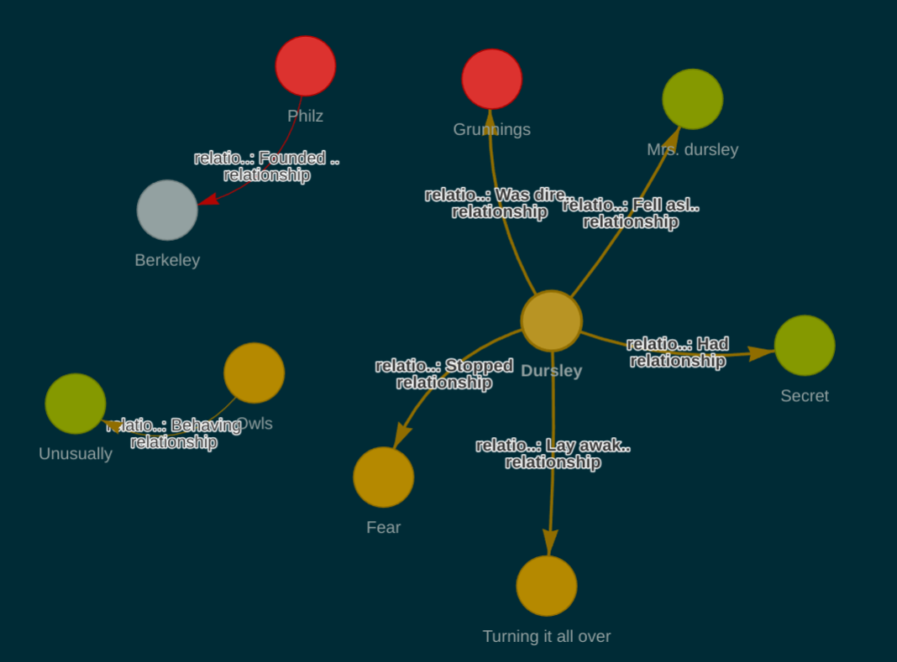

## Update
- Implemented first version of Knowledge Graph RAG
  - LlamaIndex for graph framework
  - Nebula Graph for graph store
- Found possibility for integrating memory stream in LlamaIndex
  - We can modify [ChatMemoryBuffer](https://github.com/run-llama/llama_index/blob/bad3afa8ba5d43b4b2f8d81d8e04bf7d6f52f9b0/llama-index-core/llama_index/core/memory/chat_memory_buffer.py#L15) interface to store the number of requested words and dates.
- Experienced both graph stores; Neo4j and Nebula
  - Neo4j
    - It was easy to visualize knowledge graphs on web page
    - You can't visualize the graph on notebook jupyter directly.
  - Nebula
    - You can visulaize the graph on notebook jupyter.
    - It is incompatible with [Knowledge Graph Retriever](https://docs.llamaindex.ai/en/stable/api_reference/query/retrievers/kg.html#module-llama_index.core.indices.knowledge_graph.retrievers) on LlamaIndex v0.10.6. I should try to update the version.
  - Tested integrating [Chat engine with streamlit](https://colab.research.google.com/drive/1tLjOg2ZQuIClfuWrAC2LdiZHCov8oUbs#scrollTo=vYprhy09rVf0) for displaying chats and newly generated subgraphs. But I found an undefined error in llama-index. I think LlamaIndex is unstable yet and they are working on that agilely.
  - Check the validity of RAG codes on Harry Potter book writings.
    ```
    %%ngql
    USE harry_potter_example;
    MATCH p=(n)-[*1..2]-()
    WHERE id(n) IN ['Dursley', 'Owls', 'Berkeley']
    RETURN p LIMIT 100;
    ```
    I asked about the relationship of Dursley, Owls and Berkeley.
    - Extract chapter 1 and 2 => N=10, E=7
      
    - Extract chatper 1, 2 and 3 => N=11, E=9
      


## Todo
- [x] Modify [Nebula_graph_store_tutorial.ipynb](../Nebula_graph_store_tutorial.ipynb) to be easily produce Knowledge graphs
- [ ] Implement the memory stream structures on ChatMemoryBuffer
- [x] Test Neo4j of compatible with Knowledge Graph Retriever