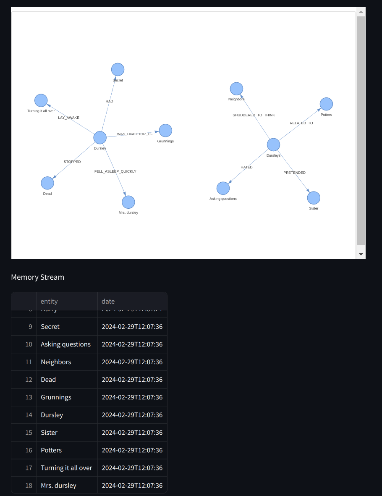

## Combined MemoryStream with RAG

I made a half version of MemoryStream with RAG.  
We should save the entities of 'response,' but I couldn't figure out how I can get those entities from Llamaindex.

We are retrieving answers through these processes.

1. Throw question to our Query Engine
2. The llm (ChatGPT3.5 in our case) extracts entities from our question to give concise information by understanding contexts.
3. Entities are used to query the Knowledge Graph using Query Engine.
4. Response from Query Engine has entities and relationships.
5. Generate answers using llm synthesizer with those entities and relationships.
6. We got the answer from the llm synthesizer.

Between 4 and 5, we should get the entities of response, but there is no function in llamaindex. Steps 4 and 5 are in one function, `query` of `RetrieverQueryEngine`.

But we can get the entities of query results of our Knowledge Graph easily. For the agile method, I just implement the memory stream using Knowledge Graph's entities.  
For example, if we ask, "Tell me about Harry", then we do a query to neo4j and can get all the relationships from our Knowledge Graph. And I am using this.

## Demo Result

### Question 1: Tell me about Harry.

### Question 2: Tell me about Dursley.

